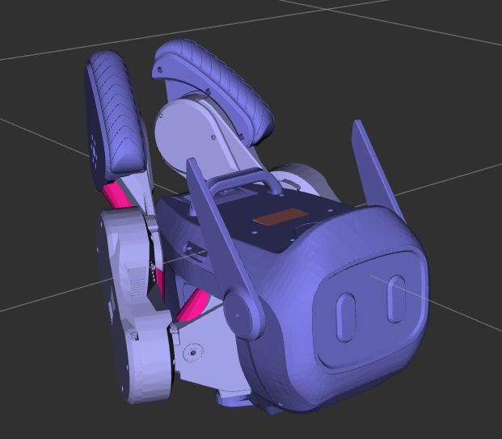

## Rviz2
```
cd Qmini_ws 
colcon build --symlink-install
source install/setup.bash
```
### 1 q1_description (原本RL訓練所使用的)

```
ros2 launch q1_description view_q1.launch.py
```


### 2 qmini_description ()

```
ros2 launch qmini_description view_qmini.launch.py
```


### 3 qmini_description_contacts ()

```
ros2 launch qmini_description view_qmini_with_contacts.launch.py

```
